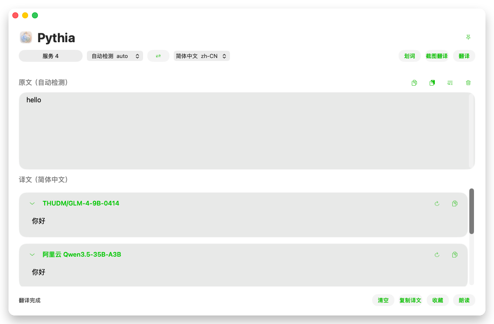
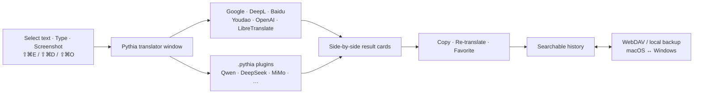

<div align="center">
  

  # Pythia

  **Every translation service, one native window — select, shoot, translate.**

  A local-first desktop translator for macOS and Windows: multi-service result cards, screenshot OCR, global hotkeys, syncable history, and a real plugin system.

  [](#download)
  [](#macos)
  [](#windows)
  [](#macos-build)
  [](#windows-development)
  [](./LICENSE)

  [English](README.md) | [简体中文](README.zh-CN.md)

  <br>
  
</div>

## What is Pythia?

Desktop translation is usually one window, one service, one opinion. When the result reads wrong you open a browser, paste the text again, and compare by hand. Pythia removes that loop: one hotkey captures text from anywhere — selection, input, or screenshot — and every enabled service answers **side by side**, so you pick the best rendering instead of trusting the only one you got.

| Everyday friction | How Pythia handles it |
| --- | --- |
| One service, take it or leave it | Independent result cards per service; re-translate any single card on demand |
| Selected text trapped in apps | Accessibility / UI Automation reading with clipboard fallback — including Microsoft Word across page breaks |
| Screenshots full of text | Screenshot OCR and screenshot translation via macOS Vision |
| Mixed Chinese/English misrouted | Dominant-script routing: embedded English terms no longer flip Chinese text onto the wrong direction |
| History stuck on one machine | WebDAV sync with merge, favorites, and deletion state through a shared `/Pythia/history/history.json` format |
| Keys pasted into random apps | Local `credentials.json` at `0600` on macOS, Windows Credential Manager — verified in Settings before use |
| Service X is missing | First-class `.pythia` plugins (`.potext` auto-converts), with an isolated runtime and a development guide |

## One keystroke, every service



## Core capabilities

### Multi-service translation

- Google works out of the box; OpenAI, DeepL, Baidu, Youdao, and LibreTranslate accept your own API keys.
- **Settings → Services → Verify** runs a real translation against the values you just typed — no guessing whether a key works.
- Dominant-script Chinese/English routing picks the right direction for mixed text; smart target language follows detection.
- Result cards support per-card copy, re-translate, TTS, and automatic copy rules.

### Capture from anywhere

- Global hotkeys for selection translate, input translate, screenshot OCR, and screenshot translation — all configurable.
- Selected-text reading falls back to the clipboard when an app blocks accessibility APIs.
- OCR runs on macOS Vision with auto language recognition; legacy OCR plugins still work.

### History, sync, and backup

- Searchable history with favorites and deletion state, or turn history off entirely.
- Incremental WebDAV sync merges concurrent additions from macOS and Windows without losing records.
- Portable backups exclude keys, WebDAV credentials, hotkeys, and window state.

### A real plugin system

- `.pythia` packages: Manifest, JavaScript entry, isolated Node runtime, declared network permissions, typed errors.
- `.potext` files are converted and validated automatically, with a compatibility fallback.
- Plugin `secret` config fields live in the same private credential store, never in settings JSON.
- The macOS and Windows plugin runners are kept byte-identical and validated by `script/validate_pythia_plugins.mjs`.

## Platforms

<table>
  <tr>
    <td width="50%" align="center">
      
      <h3 id="macos">macOS</h3>
      <p><strong>Native · current release 1.0.4</strong></p>
      <p>Swift · AppKit · macOS 26+ · Apple silicon</p>
      <p>Menu-bar app, multi-service cards, OCR, hotkeys, history sync, plugins, verified release packaging.</p>
    </td>
    <td width="50%" align="center">
      
      <h3 id="windows">Windows</h3>
      <p><strong>Flutter + Win32 · Preview</strong></p>
      <p>x64 only · Credential Manager · Inno Setup</p>
      <p>Shared history/WebDAV/plugin contracts; formal installer pending, see the handoff document.</p>
    </td>
  </tr>
</table>

## Download

### macOS

[Download Pythia 1.0.4 for macOS Apple silicon](https://github.com/douxy1994/Pythia/releases/download/v1.0.4/Pythia-1.0.4-macos-arm64.dmg)

- Requires macOS 26 or later, Apple silicon (`arm64`).
- The current build uses the project's stable local code-signing identity and is not Apple Developer ID notarized — if macOS blocks the first launch, allow it in System Settings > Privacy & Security.
- The DMG and its SHA-256 checksum are published together on the [v1.0.4 release page](https://github.com/douxy1994/Pythia/releases/tag/v1.0.4).

### Windows

The Windows x64 source, native host, installer pipeline, and automated tests are present. A formal Windows installer is not included in the current release yet. Windows development continues from [WINDOWS_CODEX_HANDOFF.md](WINDOWS_CODEX_HANDOFF.md).

## Downloadable plugins

Pythia does not bundle third-party plugins. Configuration-free packages live in [`Plugins/`](Plugins/README.md):

| Plugin | Download | Credentials required |
| --- | --- | --- |
| Alibaba Cloud Qwen3.5-35B-A3B | [`.pythia`](Plugins/aliyun-qwen3.5-35b-a3b-1.1.1.pythia) | Alibaba Cloud Model Studio API Key |
| DeepSeek | [`.pythia`](Plugins/deepseek-1.1.1.pythia) | DeepSeek API Key |
| Qiniu GLM 4.5 Air (free) | [`.pythia`](Plugins/qiniu-glm-4.5-air-free-1.1.1.pythia) | Qiniu API Key |
| SenseNova | [`.pythia`](Plugins/sensenova-1.1.1.pythia) | SenseNova API Key |
| SiliconFlow | [`.pythia`](Plugins/siliconflow-1.1.1.pythia) | SiliconFlow API Key |
| Xiaomi MiMo | [`.pythia`](Plugins/xiaomi-mimo-1.1.1.pythia) | Xiaomi MiMo API Key |

Install from **Settings > Plugins > Install Plugin**, then configure credentials inside Pythia. Packages contain no user credentials, history, or local paths. See the [plugin catalog and checksums](Plugins/README.md) for details.

## Build a Pythia plugin

New plugins should use the `.pythia` format; `.potext` is accepted only for compatibility and migration.

- [Complete plugin development guide](Docs/PYTHIA_PLUGIN_DEVELOPMENT_GUIDE.md)
- [Runnable plugin examples](examples/plugins/README.md)
- [Downloadable plugin catalog](Plugins/README.md)

The guide covers package layout, Manifest schema, configuration and secret fields, request/response protocol, network permissions, isolated runtime, error model, conversion behavior, tests, packaging commands, and the publication checklist.

## macOS build

### Requirements

- macOS 26 or later, Apple silicon Mac, Xcode 26.6 or later.
- Local code-signing identity named `Pot Local Code Signing` — it preserves the installed app's Accessibility/TCC identity across local updates; do not casually change the signing requirement or bundle identifier.

### Build, run, package, verify

```sh
./script/build_and_run.sh --verify   # build + install to /Applications + launch
./script/package_release.sh          # signed release/Pythia/Pythia.app + Pythia.dmg
```

```sh
curl -sS --max-time 5 http://127.0.0.1:60828/config
curl -sS --max-time 20 -X POST --data 'hello' http://127.0.0.1:60828/translate
codesign -d -r- /Applications/Pythia.app 2>&1
hdiutil verify release/Pythia/Pythia.dmg
```

## Windows development

The Windows client is x64/AMD64 only, under [`Windows/Pythia.Windows`](Windows/Pythia.Windows/README.md): Flutter UI, Win32 platform channels (Credential Manager, selected text, OCR, hotkeys, tray, startup, notifications, updates, window behavior), Inno Setup packaging, and a release verifier that requires PE machine `0x8664` and rejects plugins and private material.

The complete continuation document for a Windows Codex agent is **[WINDOWS_CODEX_HANDOFF.md](WINDOWS_CODEX_HANDOFF.md)** — branch baseline, toolchain, source map, MethodChannel contract, test commands, known gaps, acceptance matrix, and definition of done.

```powershell
Set-Location Windows\Pythia.Windows
flutter pub get
node ..\..\script\validate_pythia_plugins.mjs
flutter analyze
flutter test
.\tool\prepare_plugin_runtime.ps1
flutter build windows --release
dart run tool\verify_release_package.dart build\windows\x64\runner\Release
.\tool\build_windows_installer.ps1
```

## Data and privacy

| Platform | Default data location | Credentials |
| --- | --- | --- |
| macOS | `~/Library/Application Support/Pythia` | `credentials.json`, owner-only `0600` — no Keychain prompts |
| Windows | `%LOCALAPPDATA%` app directory | Windows Credential Manager |

- Portable backups exclude API keys, WebDAV credentials, shortcuts, startup state, and window state.
- Release packages contain no third-party plugins and are scanned for private material before publishing.
- The repository and release assets must never contain private keys, API keys, passwords, user history, or local configuration.
- Windows production installers must be Authenticode-signed with a certificate already installed in the build environment; no certificate file belongs in Git.

## Repository layout

```text
Pythia.xcodeproj/        Native macOS Xcode project
Pythia/                  macOS AppKit application
Core/PythiaCore/         Shared Swift models and merge tests
Core/Schemas/            Cross-platform JSON schemas
Windows/Pythia.Windows/  Flutter Windows client and Win32 host
Plugins/                 Public, credential-free .pythia downloads
examples/plugins/        Source-level plugin examples
Docs/                    Architecture, sync, Windows, plugin, and release docs
script/                  Build, package, and validation scripts
WINDOWS_CODEX_HANDOFF.md Complete Windows continuation document
```

## Development branch

Active development happens on the `master` branch of [github.com/douxy1994/Pythia](https://github.com/douxy1994/Pythia) (remote `douxy`). Historical `codex/*` branches are archived experiments and must not be used as a development base; deprecated branches carry an in-tree `DEPRECATED.md` notice.

## Documentation

- [Pythia 1.0.4 release notes](Docs/RELEASE_NOTES_1.0.4.md)
- [Architecture](Docs/ARCHITECTURE.md)
- [Feature matrix](Docs/FEATURE_MATRIX.md)
- [Plugin development guide](Docs/PYTHIA_PLUGIN_DEVELOPMENT_GUIDE.md)
- [Public plugin catalog](Plugins/README.md)
- [WebDAV synchronization](Docs/WEBDAV_SYNC.md)
- [Windows development](Docs/WINDOWS_DEVELOPMENT.md) · [Windows Codex handoff](WINDOWS_CODEX_HANDOFF.md)
- [Run and test](Docs/RUN_AND_TEST.md) · [Release checklist](Docs/RELEASE_CHECKLIST.md)

## License

Pythia is distributed under the [GNU Affero General Public License v3.0](LICENSE).

Copyright © 2026 douxy1994.
