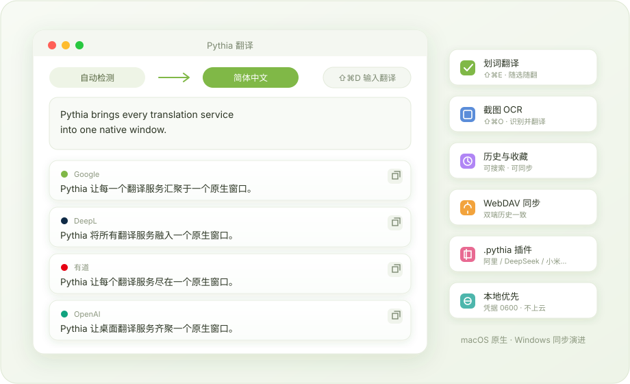
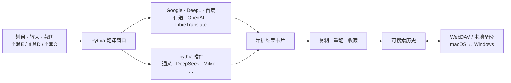
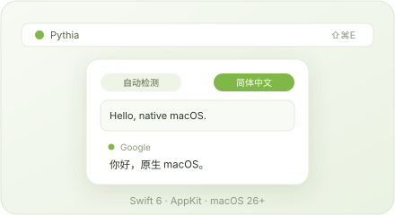
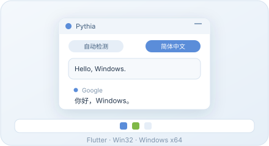

<div align="center">
  

  # Pythia

  **所有翻译服务，一个原生窗口——划词、截图、即翻。**

  本地优先的桌面翻译工具：多服务结果卡片、截图 OCR、全局快捷键、可同步的历史记录和真正的插件系统。

  [](#下载)
  [](#macos)
  [](#windows)
  [](#macos-构建)
  [](#windows-开发)
  [](./LICENSE)

  [English](README.md) | [简体中文](README.zh-CN.md)

  <br>
  
</div>

## Pythia 是什么？

桌面翻译通常是一个窗口、一个服务、一种答案。结果读起来不对时，你只能打开浏览器、重新粘贴、手动对比。Pythia 去掉了这个回路：一个快捷键从任何地方取词——划词、输入或截图——所有已启用的服务**并排作答**，你挑最好的译文，而不是被迫接受唯一的译文。

| 日常痛点 | Pythia 的处理方式 |
| --- | --- |
| 单服务结果，好坏都得认 | 每个服务独立结果卡片，任一卡片可单独重新翻译 |
| 选中的文本取不出来 | 辅助功能 / UI Automation 读取 + 剪贴板兜底——包括 Microsoft Word 跨页选文 |
| 截图里全是文字 | 基于 macOS Vision 的截图 OCR 与截图翻译 |
| 中英混排方向误判 | 主导文字路由：夹几个英文术语不再把中文文本翻错方向 |
| 历史记录困在一台机器 | WebDAV 增量同步，合并、收藏、删除状态走共享的 `/Pythia/history/history.json` 格式 |
| Key 随手填进不明应用 | macOS 本地 `credentials.json`（0600 权限）、Windows 凭据管理器，设置里可先验证再使用 |
| 缺了某个翻译服务 | 一等公民 `.pythia` 插件（`.potext` 自动转换），隔离运行时 + 完整开发指南 |

## 一键触发，全员作答



## 核心能力

### 多服务翻译

- Google 开箱即用；OpenAI、DeepL、百度、有道、LibreTranslate 填入自己的 API Key 即可。
- **设置 → 服务 → 验证**：按你刚输入的值发起一次真实翻译，Key 能不能用立刻知道。
- 中英混排按主导文字决定方向；智能目标语言跟随自动检测。
- 结果卡片支持单卡复制、重新翻译、朗读和自动复制规则。

### 随处取词

- 划词翻译、输入翻译、截图 OCR、截图翻译四组全局快捷键，全部可自定义。
- 应用拒绝辅助功能读取时自动回退剪贴板。
- OCR 使用 macOS Vision 自动识别语言；旧版 OCR 插件依然可用。

### 历史、同步与备份

- 可搜索的历史记录，支持收藏与删除状态，也可以整体关闭。
- WebDAV 增量同步合并 macOS 与 Windows 两端的新增记录，不丢数据。
- 可移植备份不包含 Key、WebDAV 凭据、快捷键与窗口状态。

### 真正的插件系统

- `.pythia` 包：Manifest + JavaScript 入口 + 隔离 Node 运行时 + 声明式网络权限 + 类型化错误。
- `.potext` 自动转换并校验，失败时保留兼容运行路径。
- 插件的 secret 配置项与设置 JSON 分离，存入同一私有凭据文件。
- macOS 与 Windows 的插件运行器保持字节一致，由 `script/validate_pythia_plugins.mjs` 守护。

## 双平台

<table>
  <tr>
    <td width="50%" align="center">
      
      <h3 id="macos">macOS</h3>
      <p><strong>原生版本 · 当前 1.0.4</strong></p>
      <p>Swift · AppKit · macOS 26+ · Apple silicon</p>
      <p>菜单栏应用、多服务卡片、OCR、快捷键、历史同步、插件、签名打包全链路。</p>
    </td>
    <td width="50%" align="center">
      
      <h3 id="windows">Windows</h3>
      <p><strong>Flutter + Win32 · 预览版</strong></p>
      <p>仅 x64 · 凭据管理器 · Inno Setup</p>
      <p>与 macOS 共享历史 / WebDAV / 插件契约；正式安装包见交接文档。</p>
    </td>
  </tr>
</table>

## 下载

### macOS

[下载 Pythia 1.0.4 macOS Apple silicon 版](https://github.com/douxy1994/Pythia/releases/download/v1.0.4/Pythia-1.0.4-macos-arm64.dmg)

- 需要 macOS 26 或更高版本，Apple silicon（`arm64`）。
- 当前构建使用项目稳定的本地代码签名身份，未经 Apple Developer ID 公证——首次打开如被拦截，请在「系统设置 > 隐私与安全性」中允许。
- DMG 和 SHA-256 校验文件同时发布在 [v1.0.4 Release 页面](https://github.com/douxy1994/Pythia/releases/tag/v1.0.4)。

### Windows

Windows x64 源码、原生宿主、安装包流水线与自动化测试均已就绪，正式安装包尚未包含在当前 Release 中。Windows 端开发从 [WINDOWS_CODEX_HANDOFF.md](WINDOWS_CODEX_HANDOFF.md) 继续。

## 可下载插件

应用不捆绑第三方插件，不含用户配置的包在 [`Plugins/`](Plugins/README.md) 单独提供：

| 插件 | 下载 | 所需凭据 |
| --- | --- | --- |
| 阿里云 Qwen3.5-35B-A3B | [`.pythia`](Plugins/aliyun-qwen3.5-35b-a3b-1.1.1.pythia) | 阿里云百炼 API Key |
| DeepSeek | [`.pythia`](Plugins/deepseek-1.1.1.pythia) | DeepSeek API Key |
| 七牛 GLM 4.5 Air（免费） | [`.pythia`](Plugins/qiniu-glm-4.5-air-free-1.1.1.pythia) | 七牛 API Key |
| 商汤 SenseNova | [`.pythia`](Plugins/sensenova-1.1.1.pythia) | SenseNova API Key |
| SiliconFlow | [`.pythia`](Plugins/siliconflow-1.1.1.pythia) | SiliconFlow API Key |
| 小米 MiMo | [`.pythia`](Plugins/xiaomi-mimo-1.1.1.pythia) | 小米 MiMo API Key |

从 **设置 > 插件 > 安装插件** 安装，凭据在 Pythia 内配置。插件包不含任何用户凭据、历史记录或本机路径，详见[插件目录与校验和](Plugins/README.md)。

## 开发 Pythia 插件

新插件请使用 `.pythia` 格式，`.potext` 仅用于兼容与迁移。

- [完整插件开发指南](Docs/PYTHIA_PLUGIN_DEVELOPMENT_GUIDE.md)
- [可运行插件示例](examples/plugins/README.md)
- [可下载插件目录](Plugins/README.md)

指南涵盖包结构、Manifest 规范、配置与密钥字段、请求/响应协议、网络权限、隔离运行时、错误模型、转换行为、测试、打包命令与发布清单。

## macOS 构建

### 环境要求

- macOS 26 或更高版本、Apple silicon Mac、Xcode 26.6 或更高版本。
- 本机代码签名身份 `Pot Local Code Signing`——它保证本机更新后辅助功能/TCC 身份不变，请勿随意改动签名要求或 Bundle ID。

### 构建、运行、打包、验证

```sh
./script/build_and_run.sh --verify   # 构建 + 安装到 /Applications + 启动
./script/package_release.sh          # 签名输出 release/Pythia/Pythia.app + Pythia.dmg
```

```sh
curl -sS --max-time 5 http://127.0.0.1:60828/config
curl -sS --max-time 20 -X POST --data 'hello' http://127.0.0.1:60828/translate
codesign -d -r- /Applications/Pythia.app 2>&1
hdiutil verify release/Pythia/Pythia.dmg
```

## Windows 开发

Windows 客户端仅支持 x64/AMD64，位于 [`Windows/Pythia.Windows`](Windows/Pythia.Windows/README.md)：Flutter UI、Win32 平台通道（凭据管理器、选中文本、OCR、快捷键、托盘、开机启动、通知、更新、窗口行为）、Inno Setup 打包，以及要求 PE machine `0x8664`、拒绝插件与私密材料的发布校验器。

Windows Codex 代理的完整交接文档：**[WINDOWS_CODEX_HANDOFF.md](WINDOWS_CODEX_HANDOFF.md)**——分支基线、工具链、源码地图、MethodChannel 契约、测试命令、已知缺口、验收矩阵与完成定义。

```powershell
Set-Location Windows\Pythia.Windows
flutter pub get
node ..\..\script\validate_pythia_plugins.mjs
flutter analyze
flutter test
.\tool\prepare_plugin_runtime.ps1
flutter build windows --release
dart run tool\verify_release_package.dart build\windows\x64\runner\Release
.\tool\build_windows_installer.ps1
```

## 数据与隐私

| 平台 | 默认数据位置 | 凭据存储 |
| --- | --- | --- |
| macOS | `~/Library/Application Support/Pythia` | `credentials.json`，0600 仅所有者可读——不弹钥匙串 |
| Windows | 应用数据目录 | Windows 凭据管理器 |

- 可移植备份不包含 API Key、WebDAV 凭据、快捷键、启动状态与窗口状态。
- Release 包不含第三方插件，发布前经过私密材料扫描。
- 仓库与 Release 资产绝不包含私钥、API Key、密码、用户历史或本机配置。
- Windows 正式安装包必须使用构建环境中已安装的证书做 Authenticode 签名，证书文件不进 Git。

## 仓库结构

```text
Pythia.xcodeproj/        原生 macOS Xcode 工程
Pythia/                  macOS AppKit 应用
Core/PythiaCore/         共享 Swift 模型与合并测试
Core/Schemas/            跨平台 JSON Schema
Windows/Pythia.Windows/  Flutter Windows 客户端与 Win32 宿主
Plugins/                 公开、无凭据的 .pythia 下载
examples/plugins/        源码级插件示例
Docs/                    架构、同步、Windows、插件与发布文档
script/                  构建、打包与校验脚本
WINDOWS_CODEX_HANDOFF.md 完整 Windows 交接文档
```

## 开发分支

活跃开发在 [github.com/douxy1994/Pythia](https://github.com/douxy1994/Pythia) 的 `master` 分支（远程 `douxy`）。历史上的 `codex/*` 分支是归档实验，不能作为开发基线；已弃用的分支内有 `DEPRECATED.md` 说明。

## 文档

- [Pythia 1.0.4 发布说明](Docs/RELEASE_NOTES_1.0.4.md)
- [架构设计](Docs/ARCHITECTURE.md)
- [功能矩阵](Docs/FEATURE_MATRIX.md)
- [插件开发指南](Docs/PYTHIA_PLUGIN_DEVELOPMENT_GUIDE.md)
- [公开插件目录](Plugins/README.md)
- [WebDAV 同步](Docs/WEBDAV_SYNC.md)
- [Windows 开发](Docs/WINDOWS_DEVELOPMENT.md) · [Windows Codex 交接](WINDOWS_CODEX_HANDOFF.md)
- [运行与测试](Docs/RUN_AND_TEST.md) · [发布清单](Docs/RELEASE_CHECKLIST.md)

## License

Pythia 基于 [GNU General Public License v3.0](LICENSE) 发布。
